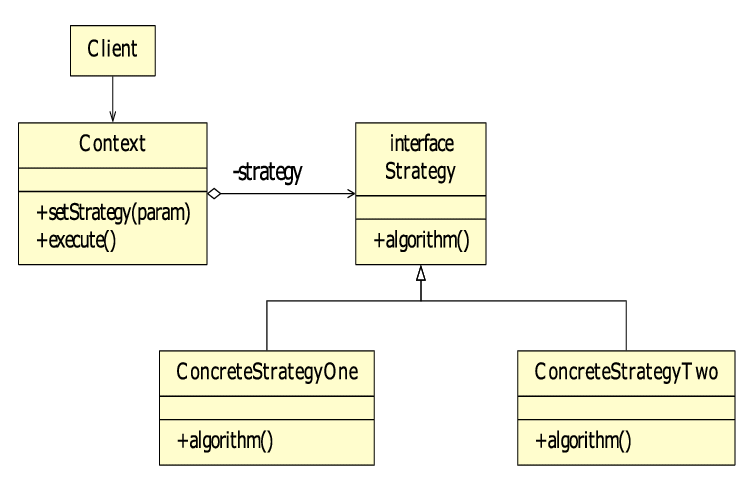

# Strategy Pattern

- interface 개념을 이해한다.
- deligate 개념을 이해한다.
- strategy pattern 개념을 이해한다.

## interface
1. 기능의 선언
2. 기능의 구현
3. 기능의 통로

```
참고로 intellij에서 project는 단일 프로젝트를 원칙으로 한다.
eclispe처럼 worspace를 두고 여러 연관없는 프로젝트를 두기 위해서는
empty project를 생성한뒤, run path 설정해주면 되지만
원칙적으로 이는 권장되지 않는 방식이다.

기억할 것은 intellij는 단일 프로젝트 단일 화면이다.
```

## Deligate
> 위임하다, 떠넘기다

- 어떤 기능을, 다른 객체에게 떠넘긴다.
- 개발 당시 특정 기능 구현이 완료되지 않았어도, 만들어졌다고 가정하고 (inteface)이후의 상황에 대해서 logic을 짜는 것을 말함.

```
만약 AObj에서 funcA가 필요하다고 하였을때, 해당 기능 func을 생성한다.
이후 다른 팀에게 deligate시키고 개발을 진행한다.
기능이 완료되면 해당 팀의 구현체를 copy&paste를 하는 것이 아닌
interface를 불러와 기능을 수행한다.
```


## Strategy Pattern
> 여러 알고리즘을 하나의 추상적인 접근점(interface)을 만들어 접근점에서 서로 교환 가능하도록 하는 패턴

- 핵심
    - 추상적인 접근점
    - 기능 교환

```
1. 전략을 사용하는 client
2. 추상적인 Strategy Interface
3. (2)를 구현하는 각각의 Strategies
```



- 연습문제
```
- 게임 캐릭터
- 무기
- 검, 활, 도끼
```


