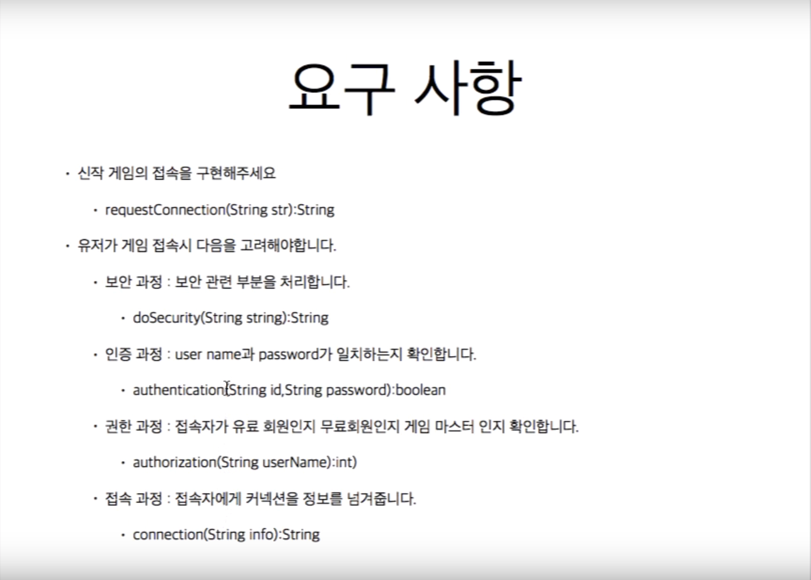
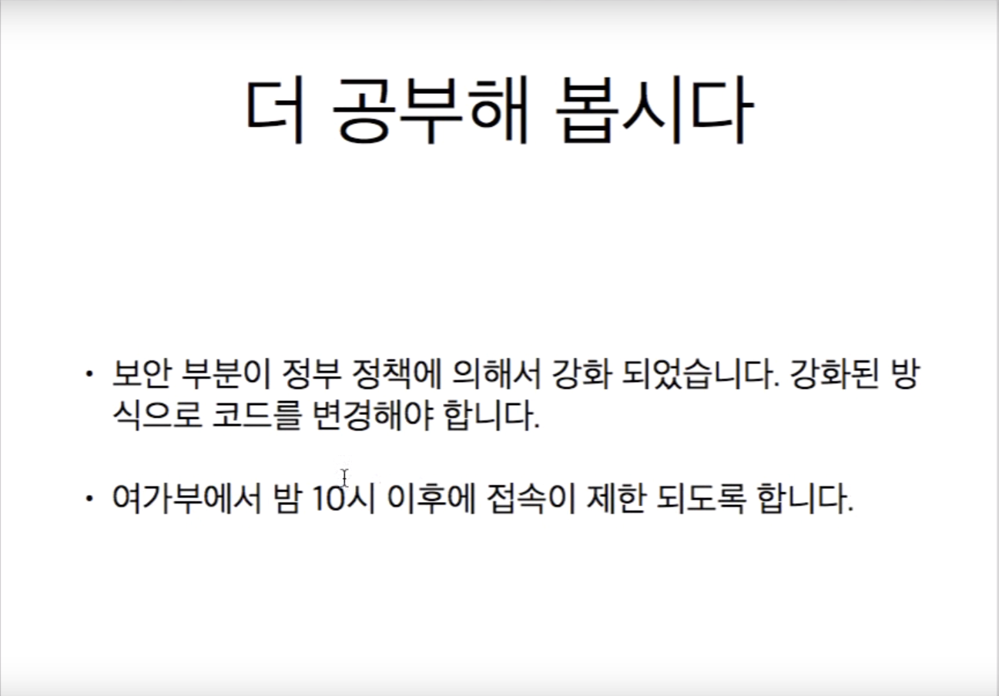

# Template Method Pattern
- **일정한 프로세스**를 가진 요구사항을 템플릿 메소드 패턴을 활용해 구현할 수 있다.

## Template Method Pattern 이란
- 알고리즘의 **구조를 메소드에 정의**하고, 하위 클래스에서 알고리즘의 구조를 변경없이 **재정의** 하는 패턴

## 사용 경우
- 구현하려는 알고리즘이 일정한 프로세스가 있다.
- 구현하려는 알고리즘의 변경 가능성이 작은 파트 존재
    - `abstract class`(부모 클래스)에서 템플릿 method로 구현
    - 변경 가능성이 높은 `protected method` collection
- 구현하려는 알고리즘의 변경 가능성이 큰 파트 존재
    - `sub class`에서 `protected method` Overriding하여 구현

## `Factory Method`와의 차이를 생각하며 특징
- 팩토리 메서드:
    - @사용이유:
        - 어떤 기능이 추가될지 미리 알 수 없는 경우 유용
            - 서브 클래스에게 객체 생성을 위임하였기 때문에
        - 인터페이스를 바탕으로 유연성과 확장성이 뛰어난 코드 제작 가능
        - 추상화된 것에 의존(클라이언트가 부모 interface의존)
            - 역전의존의 법칙 부합

    - **서브 클래스에서 오브젝트 생성 방식과 클래스 결정**
        - mySqlDB vs OracleDB 결정을 서브클래스에서
        - DB를 WAS와 생성하는 종합적인 method는 Super class에서 구현
        - ItemCreator(부모)는 HpCreator(서브), MpCreator(서브)를 실제로 구현한다.
        - (HP,MP)Creator에서 실제적인 Item을 생산한다.
        - Main클래스
        ```java
            ItemCreator creator;
            Item item;
            creator = new HpCreator();
            item = creator.create();
            item.use();
            creator = new MpCreator();
            item = creator.create();
            item.use();
        ```
- 템플릿 메서드:
    - @사용이유: 
    - `Abstract class`에서 이미 템플릿 Method가 생성되어있다.
    - `Sub class`에서는 `Protected Method`만 `@Override`하여 수정해준다.


## 생성 방법
1. 알고리즘을 여러 단계로 나눈다.
2. 나눠진 알고리즘의 단계를 메소드로 선언한다. (`Abstract class`)
    - 각 method들 선언은 하위 클래스에서 override해주어야 한다.
    - 그러므로 **protected method**로 정의
3. 알고리즘을 수행할 템플릿 메소드 생성. (`Abstract class`)
    - 각 메소드를 실행시키는 템플릿 메소드를 정의한다.
4. 하위 클래스에서 나눠진 메소드들을 구현한다(`DefaultConnectHelper`)
    - extend Abstract class
5. Main method에서 생성 후 실행
    - 이때 Helper class의 패키지와 Main 패키지를 나누어 주어야 한다.
        - protected로 구현된 code들을 Main에서 접근하지 못하도록함
    - `AbsConnectHelper helper = new DefaultConnectHelper();`
    - `helper.템플릿method();`
        - 템플릿 메소드를 통해 알고리즘 실행

## 예제 요구사항


## 추가 요구사항


